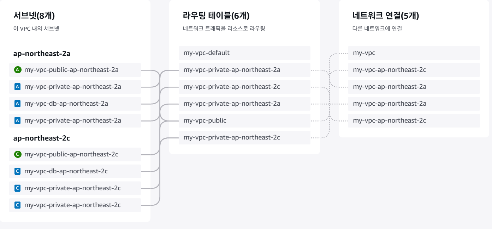
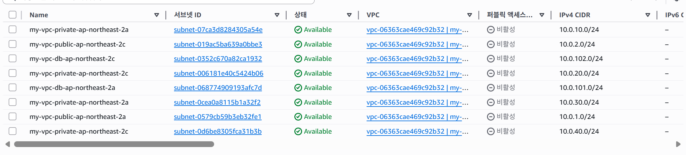
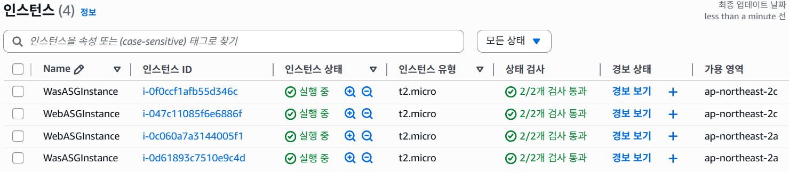
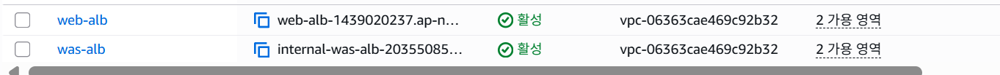
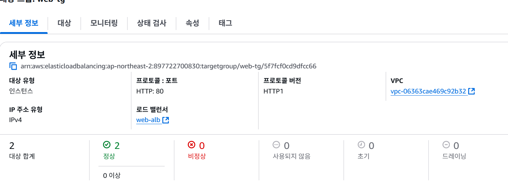
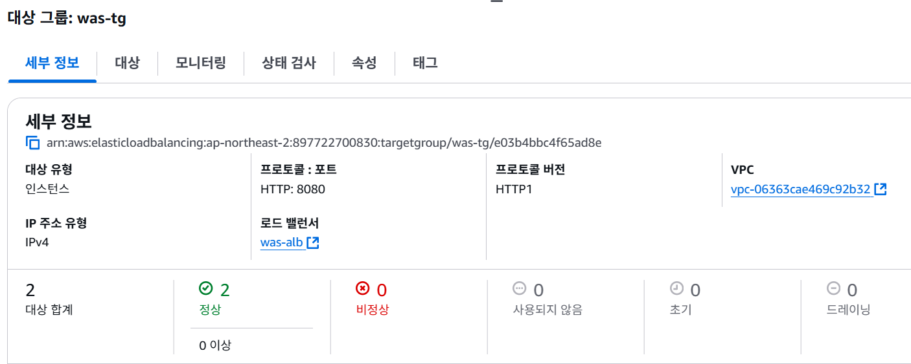
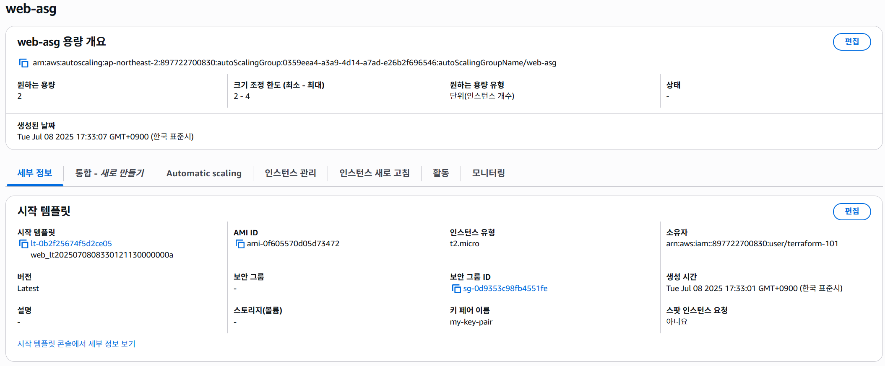
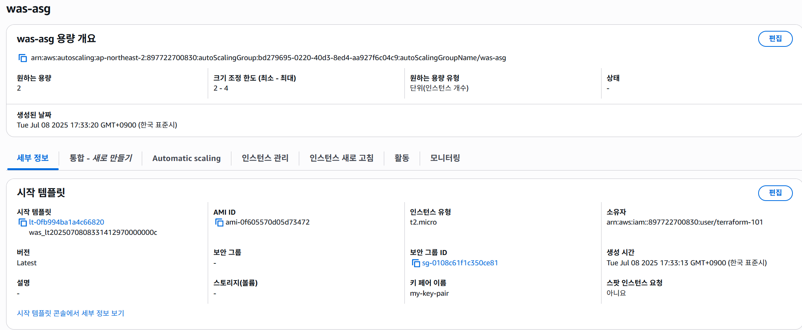
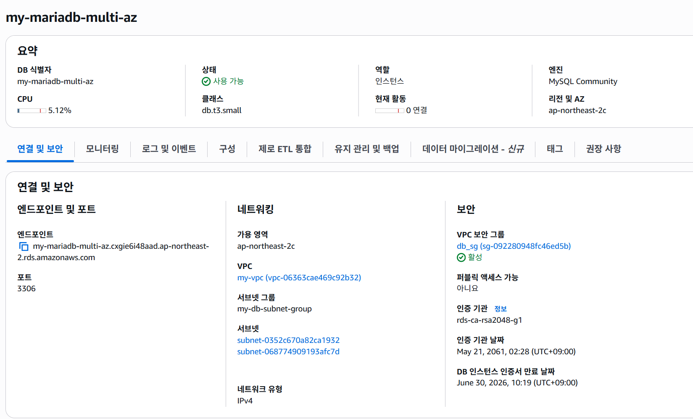

### VPC  
**[리소스 맵]**  
 
  
  

**[서브넷]**  
 
  
 

- **총 8개 서브넷**
  - 퍼블릭 서브넷 2개
  - 프라이빗 서브넷 6개
    - WAS & WEB 서브넷 4개
    - Database 서브넷 2개

  

### EC2  
  
  

---

### ALB  
  
 

- **Web_alb**: 웹서버를 대상으로 로드 밸런싱
- **Was_alb**: 어플리케이션 서버를 대상으로 로드 밸런싱

  

**[Web_ALB_Target_group]**  
  
  

**[Was_ALB_Target_group]**  
  
  

---

### ASG  
  
  
  
  

---

### RDS  
  
 

- **Multi-AZ 구성**으로 장애 시 자동 Failover
- 백업 보존 기간: 최대 7일

